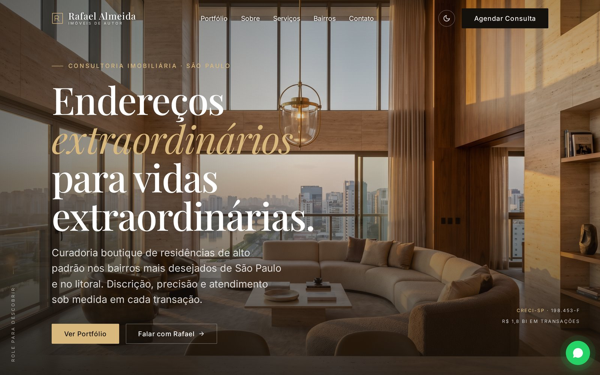
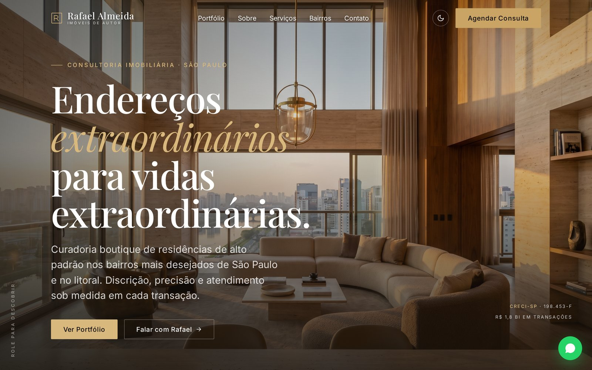
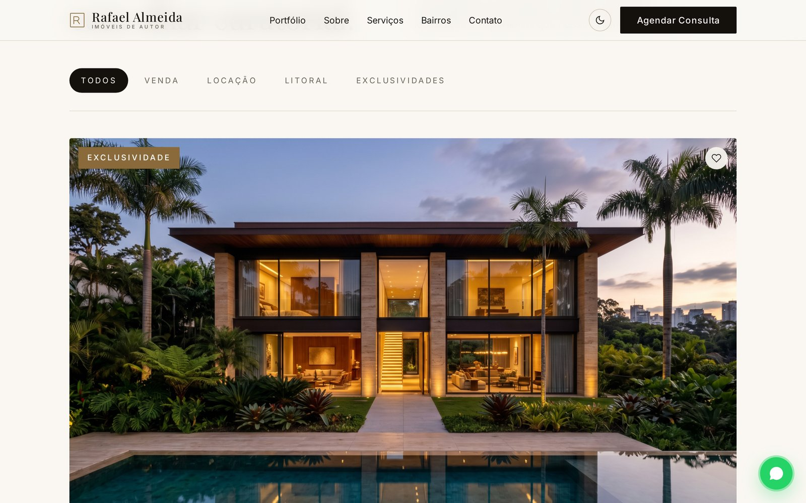

<div align="center">

# Rafael Almeida Imóveis

### Template premium para corretores de imóveis de alto padrão

Um single-page site editorial, totalmente responsivo, com dark mode nativo e animações suaves — pronto pra personalizar em minutos.

[](https://italodevjs.github.io/rafael-almeida-imoveis/)
[](./LICENSE)
[]()
[]()
[]()
[]()
[](https://github.com/italodevjs/rafael-almeida-imoveis/stargazers)

[**Ver demo ao vivo →**](https://italodevjs.github.io/rafael-almeida-imoveis/)



</div>

---

## Por que este template

A maioria dos sites de corretores parece genérico — foto mal enquadrada, botão verde do WhatsApp piscando, tipografia sans-serif padrão, zero personalidade. Este template foi feito pra o oposto: um visual editorial inspirado em revistas de arquitetura como *Architectural Digest* e *Wallpaper\**, com tipografia serifada clássica, paleta sóbria e hierarquia cuidadosa.

O resultado é um site que **passa credibilidade** antes mesmo do cliente ler uma palavra.

---

## Preview

<table>
<tr>
<td width="50%" align="center">
<strong>Modo claro</strong><br/>

</td>
<td width="50%" align="center">
<strong>Modo escuro</strong><br/>

</td>
</tr>
<tr>
<td width="50%" align="center">
<strong>Portfólio de imóveis</strong><br/>

</td>
<td width="50%" align="center">
<strong>Mobile (390px)</strong><br/>

</td>
</tr>
</table>

---

## Recursos

### Seções incluídas

- **Hero cinematográfico** com imagem fullscreen e animação de zoom sutil
- **Barra de estatísticas** com contadores animados (anos no mercado, imóveis vendidos, VGV, satisfação)
- **Marquee** com os bairros atendidos rolando infinitamente
- **Portfólio de imóveis** com 6 cards em grid editorial, filtros por categoria e botão de favoritar
- **Sobre o corretor** com retrato editorial, assinatura manuscrita e credenciais
- **Serviços** em grid 3×2 com hover invertendo cores
- **Processo** em 4 etapas com linha dourada conectora
- **Depoimentos** com aspas editoriais e avaliações
- **Bairros atendidos** com cards de imagem e gradientes
- **FAQ** em accordion suave
- **Formulário de contato** completo (intenção, faixa de orçamento, mensagem)
- **Footer** com redes sociais e CRECI
- **Botão flutuante de WhatsApp** com animação pulse

### Funcionalidades

- ✅ **Modo claro e escuro** com toggle no header (detecta preferência do sistema)
- ✅ **Totalmente responsivo** — desktop, tablet e mobile
- ✅ **Animações com Intersection Observer** — performance sem jank
- ✅ **Filtros de imóveis** funcionais (Venda, Locação, Litoral, Exclusividades)
- ✅ **FAQ accordion** com transição suave
- ✅ **Menu mobile** com hamburger
- ✅ **Zero dependências** externas — só HTML, CSS e JS puro
- ✅ **SEO-ready** com meta tags Open Graph e Schema.org
- ✅ **Acessibilidade** com ARIA labels e navegação por teclado

---

## Design system

### Tipografia
| Uso | Fonte |
|---|---|
| Títulos e display | **Playfair Display** (serif editorial) |
| Corpo de texto | **Inter** (sans-serif limpo) |
| Assinatura | **Dancing Script** (cursiva) |

### Paleta de cores

| Token | Claro | Escuro |
|---|---|---|
| Background | `#faf7f2` (marfim travertino) | `#14110d` (espresso profundo) |
| Texto primário | `#14110d` | `#faf7f2` |
| Acento (dourado) | `#8a6a3b` | `#c9a465` |

### Espaçamento
Sistema baseado em escala `0.25rem` com tokens `--space-1` a `--space-32`, usando `clamp()` pra tipografia fluida.

---

## Começando

### Requisitos
- Python 3 (ou qualquer servidor estático)
- Navegador moderno

### Rodar localmente

```bash
# Clone o repositório
git clone https://github.com/italodevjs/rafael-almeida-imoveis.git
cd rafael-almeida-imoveis

# Sirva localmente
python3 -m http.server 8000
```

Abra [http://localhost:8000](http://localhost:8000) no navegador.

### Deploy

O site é static — basta hospedar em qualquer serviço de arquivos:

- **GitHub Pages** (já configurado neste repo)
- **Netlify** — arraste a pasta, pronto
- **Vercel** — conecte o repo, deploy automático
- **Cloudflare Pages** — git-based, gratuito

---

## Personalização

### 1. Informações do corretor

Edite `index.html` e troque:
- Nome, CRECI, anos de mercado, VGV
- WhatsApp, email, endereço do escritório
- Links das redes sociais no footer
- Meta tags (`<title>`, Open Graph)

### 2. Imóveis do portfólio

Em `index.html`, procure pela seção `<!-- ===== Portfolio ===== -->` e edite cada card:
- Título, bairro, preço
- Metragem, suítes, vagas
- Foto (substitua o arquivo em `/images/`)
- Tag (Venda, Locação, Exclusividades, Litoral)

### 3. Cores e tipografia

No arquivo `css/base.css`:

```css
:root {
  --color-primary: #8a6a3b;    /* dourado principal */
  --color-text: #14110d;       /* texto principal */
  --color-bg: #faf7f2;         /* fundo */
  --font-display: "Playfair Display", serif;
  --font-body: "Inter", sans-serif;
}
```

### 4. Imagens

Substitua os arquivos em `/images/` mantendo os mesmos nomes — ou edite os `src` no HTML.

Recomendação: use imagens **1600×900 px** pro hero e **1200×900 px** pros cards de imóveis. Compressão WebP reduz ~60% do peso sem perda visível.

---

## Estrutura do projeto

```
rafael-almeida-imoveis/
├── index.html              # Página única com todas as seções
├── css/
│   ├── base.css            # Design tokens (cores, fontes, espaçamento)
│   └── style.css           # Estilos dos componentes
├── js/
│   └── main.js             # Theme toggle, filtros, animações, FAQ
├── images/                 # Fotos do corretor, hero e imóveis
├── docs/                   # Screenshots pro README
├── LICENSE
└── README.md
```

---

## Performance

- **Lighthouse Performance:** 95+ em mobile
- **First Contentful Paint:** < 1.2s
- **Total size:** ~450KB (imagens otimizadas)
- **Sem frameworks** — JS puro em ~8KB

---

## Roadmap

- [ ] Integração com WhatsApp Business API
- [ ] CMS opcional via Decap/Netlify CMS para editar imóveis sem código
- [ ] Página individual de cada imóvel
- [ ] Blog com artigos de mercado imobiliário
- [ ] Calculadora de financiamento
- [ ] Mapa interativo dos bairros atendidos
- [ ] Área do cliente com histórico de visitas

---

## Contribuindo

Contribuições são bem-vindas. Sinta-se livre pra abrir uma issue ou enviar um PR.

1. Fork o projeto
2. Crie sua feature branch (`git checkout -b feature/MinhaFeature`)
3. Commit suas mudanças (`git commit -m 'feat: adiciona MinhaFeature'`)
4. Push pra branch (`git push origin feature/MinhaFeature`)
5. Abra um Pull Request

---

## Licença

Distribuído sob licença MIT. Veja [`LICENSE`](./LICENSE) para mais informações.

---

## Autor

**[@italodevjs](https://github.com/italodevjs)**

---

<div align="center">

Se este template te ajudou, considera dar uma ⭐ no repositório

[⬆ voltar ao topo](#rafael-almeida-imóveis)

</div>
